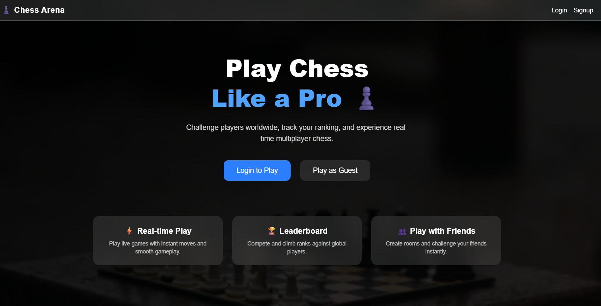
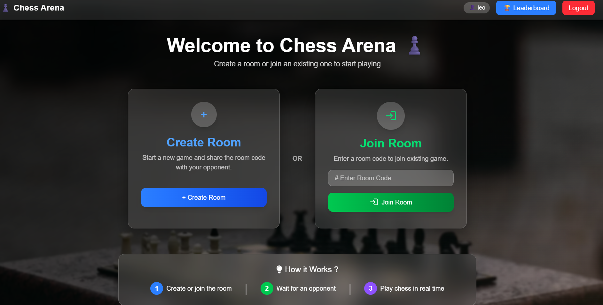
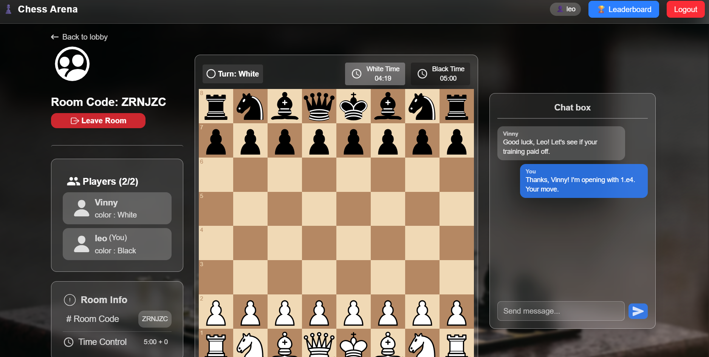
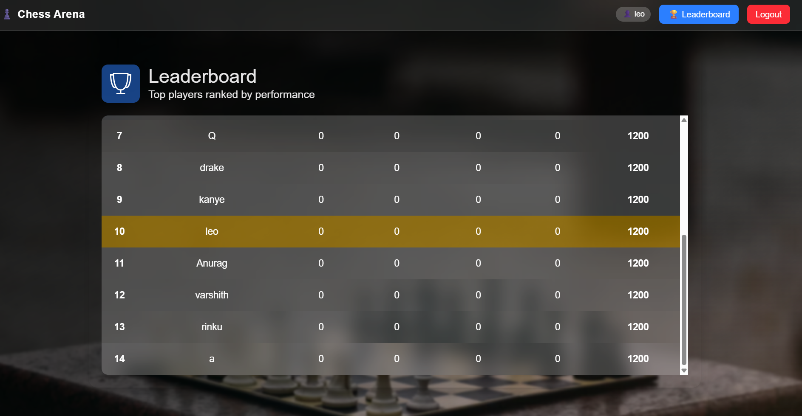

# ♟️ Chess Game – Real-Time Multiplayer Chess Platform

A production-ready full-stack real-time multiplayer chess application where users can register, authenticate, upload profile pictures, create or join game rooms, and compete in live chess matches with synchronized gameplay.

Built using the **MERN stack** with **Socket.IO real-time communication**, **MongoDB Atlas**, **Cloudinary image storage**, and deployed using **Vercel and Render**.

---

# 📸 Screenshots

## 🔐 Login Page



---

## 🏠 Dashboard



---

## ♟️ Live Chess Game



---

## 🏆 Leaderboard



---

## 🎥 Demo


---

# 🌐 Live Demo

Frontend:  
[https://play-chess-online.vercel.app](https://play-chess-online.vercel.app)

Backend API:  
[https://chess-game-backend-vzal.onrender.com](https://chess-game-backend-vzal.onrender.com)

---

# 🚀 Key Highlights

- ♟️ Real-time multiplayer chess gameplay using **Socket.IO**
- 🔐 Secure authentication using **JWT and bcrypt**
- 🖼️ Profile image uploads using **Cloudinary**
- 🗄️ MongoDB Atlas database integration
- ⚡ Live chess move synchronization between players
- ✅ Chess move validation using **chess.js**
- 📱 Responsive React frontend
- 🏆 Leaderboard and player statistics
- ☁️ Production deployment using **Vercel + Render**
- 🔄 GitHub-based continuous deployment workflow

---

# ✨ Features

## Authentication

- User registration
- User login
- JWT authentication
- Password hashing using bcrypt
- Secure cookie-based sessions
- Protected routes

---

## Profile Management

- Upload profile pictures
- Store images using Cloudinary
- Save image URLs in MongoDB

---

## Multiplayer Chess

- Create chess rooms
- Join existing rooms
- Two-player online gameplay
- Real-time board updates
- Live move synchronization
- Chess rule validation using chess.js
- Player disconnect handling

---

## Leaderboard

- Track player statistics
- Store rankings
- Display leaderboard information

---

# 🛠️ Tech Stack

## Frontend

- React.js
- Vite
- React Router
- Axios
- Socket.IO Client
- CSS

## Backend

- Node.js
- Express.js
- Socket.IO
- JWT Authentication
- bcrypt
- Multer
- Cloudinary
- Cookie Parser
- CORS
- dotenv

## Database

- MongoDB Atlas
- Mongoose ODM

## Deployment

- Vercel
- Render
- GitHub

---

# 🏗️ System Architecture

```
                React Frontend
                      |
          Axios + Socket.IO Client
                      |
              Express Backend
                      |
              Socket.IO Server
                      |
        ----------------------------
        |                          |
 MongoDB Atlas               Cloudinary
(User Data)              (Profile Images)
```

---

# 📂 Project Structure

```
Chess-Game
│
├── frontend
│   ├── src
│   ├── public
│   ├── package.json
│   └── vite.config.js
│
├── backend
│   ├── controllers
│   ├── middleware
│   ├── models
│   ├── routes
│   ├── socket
│   ├── utils
│   ├── package.json
│   └── index.js
│
└── README.md
```

---

# 🔐 Authentication Flow

1. User registers an account.
2. Password is encrypted using bcrypt.
3. User data is stored in MongoDB Atlas.
4. JWT access and refresh tokens are generated.
5. Authentication cookies are sent securely.
6. Protected routes verify user identity.

---

# ♟️ Real-Time Communication

Socket.IO handles:

- Room creation
- Player joining
- Real-time connections
- Chess moves
- Turn updates
- Board synchronization
- Disconnect events

Chess.js validates:

- Legal moves
- Game rules
- Board state

---

# 🖼️ Image Upload System

Profile uploads use:

- Multer
- Cloudinary
- multer-storage-cloudinary

Workflow:

```
User Upload
     |
   Multer
     |
 Cloudinary
     |
Image URL stored in MongoDB
```

---

# 🗄️ Database

MongoDB Atlas stores:

- User accounts
- Authentication information
- Profile image URLs
- Leaderboard data
- Player statistics

Mongoose provides:

- Schema modelling
- Validation
- CRUD operations

---

# 🌍 Production Deployment

The application is fully deployed and publicly accessible.

## Frontend

- Hosted on **Vercel**
- React + Vite production build
- Environment variable configuration
- Connected with backend API

## Backend

- Hosted on **Render**
- Express production server
- Socket.IO server deployment
- CORS configuration
- Environment variable management

## Database

- Hosted on **MongoDB Atlas**

## Image Storage

- Powered by **Cloudinary**

---

# ⚙️ Environment Variables

## Backend

```env
MONGODB_URL=

JWT_ACCESS_SECRET=

JWT_REFRESH_SECRET=

CLOUDINARY_CLOUD_NAME=

CLOUDINARY_API_KEY=

CLOUDINARY_SECRET_KEY=

CLIENT_URL=

PORT=
```

## Frontend

```env
VITE_API_URL=
```

---

# 🚀 Installation

## Clone Repository

```bash
git clone https://github.com/Varshith-kummarikunta/Chess-Game.git

cd Chess-Game
```

---

## Backend Setup

```bash
cd backend

npm install

npm run dev
```

---

## Frontend Setup

```bash
cd frontend

npm install

npm run dev
```

---

# 🧪 Testing Checklist

✅ User registration  
✅ User login  
✅ JWT authentication  
✅ Profile image upload  
✅ Create game room  
✅ Join game room  
✅ Multiplayer chess gameplay  
✅ Real-time synchronization  
✅ Leaderboard  
✅ MongoDB connection  
✅ Cloudinary uploads  
✅ Production deployment  

---

# 🔮 Future Improvements

- Spectator mode
- Match history
- Friend system
- In-game chat
- Matchmaking
- Chess timer
- Draw and resignation options
- Email verification
- Password reset
- Elo rating system

---

# 👨‍💻 Author

**Varshith Kummarikunta**

GitHub:  
https://github.com/Varshith-kummarikunta

LinkedIn:  
https://linkedin.com/in/varshith-kummarikunta

---

# 📄 License

This project is licensed under the MIT License.

---

⭐ If you like this project, consider giving it a star on GitHub.